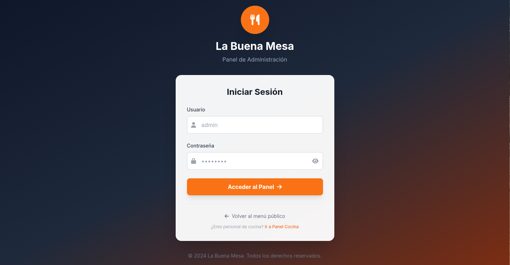
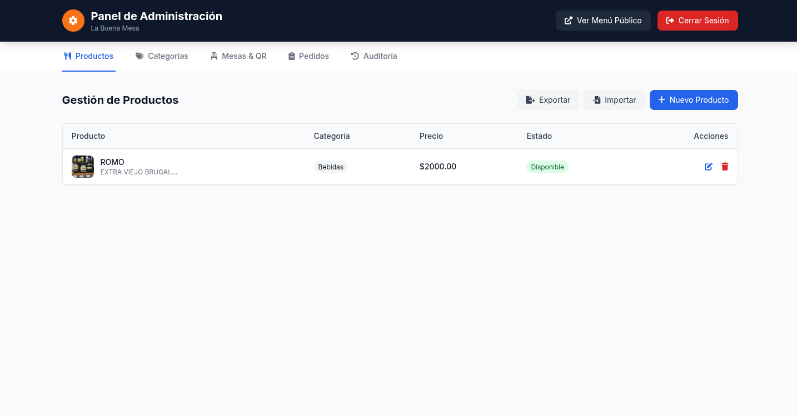
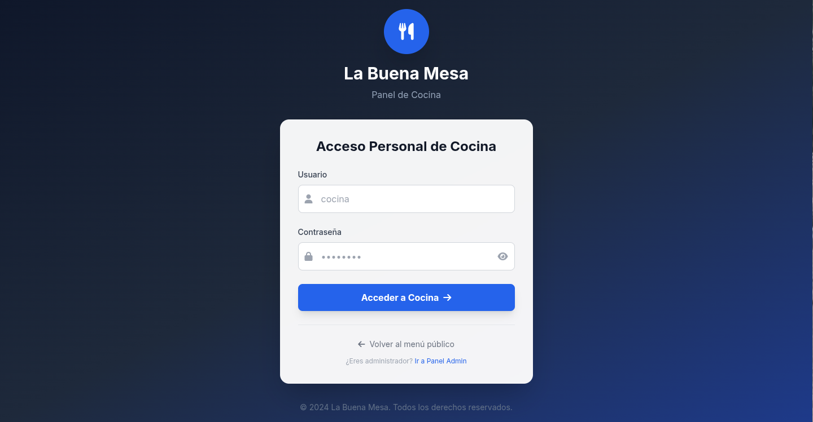
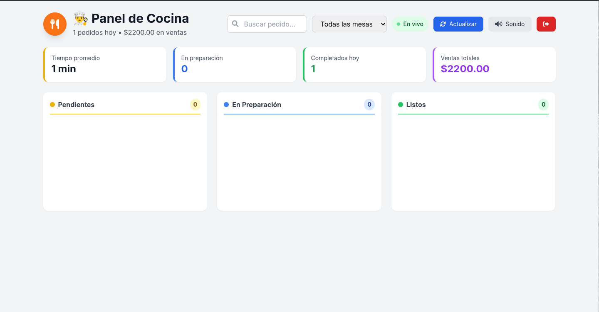
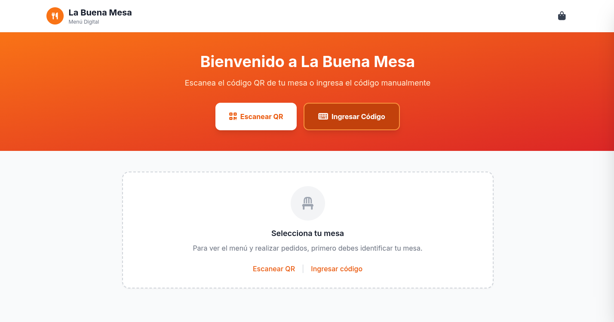

# 🍽️ La Buena Mesa - Sistema de Menú Digital

Sistema completo de gestión de restaurante con menú digital, pedidos por QR, panel de administración y cocina en tiempo real.

---

## 📋 Índice

- [Características](#-características)
- [Arquitectura](#-arquitectura)
- [Instalación](#-instalación)
- [Uso](#-uso)
- [Estructura](#-estructura)
- [API](#-api)
- [WebSocket](#-websocket)
- [Seguridad](#-seguridad)
- [Screenshots](#-screenshots)

---

## ✨ Características

### 🎯 Público (Clientes)
- Escaneo de QR para acceder al menú de la mesa
- Ingreso manual de código de mesa
- Menú filtrado por categorías
- Carrito de compras con modificadores
- Pedidos en tiempo real
- Seguimiento de estado del pedido

### ⚙️ Administración
- **Productos**: CRUD completo, importar/exportar JSON
- **Categorías**: Gestión con iconos y colores
- **Mesas**: Generación de códigos QR únicos
- **Pedidos**: Vista completa y cambio de estados
- **Auditoría**: Logs de todas las acciones

### 👨‍🍳 Cocina
- Dashboard tipo Kanban (Pendientes → En preparación → Listos)
- Drag & drop entre columnas
- Timers con alertas de tiempo
- Notificaciones sonoras
- Impresión de tickets

---

## 🏗️ Arquitectura

```

┌─────────────────────────────────────────────────────────┐
│                    CLIENTE (Navegador)                   │
├─────────────────────────────────────────────────────────┤
│  Público  │  Admin  │  Cocina  │  API  │  WebSocket    │
│  (index)  │ (admin) │ (cocina) │(REST) │   (Socket.io) │
└─────────────────────────────────────────────────────────┘
│
┌─────────────────────────────────────────────────────────┐
│              SERVIDOR NODE.JS + EXPRESS                 │
│  ├─ Autenticación por sesiones (express-session)       │
│  ├─ Base de datos JSON (lowdb)                         │
│  ├─ Generación de QR codes (qrcode)                    │
│  └─ WebSockets para tiempo real (socket.io)            │
└─────────────────────────────────────────────────────────┘

````

---

## 🚀 Instalación

### Requisitos
- Node.js >= 14.x
- NPM >= 6.x

### Pasos

1. Clonar repositorio
```bash
git clone https://github.com/MichaelDavidMR/La-Buena-Mesa---Sistema-de-Men-Digital.git
````

2. Entrar al proyecto

```bash
cd La-Buena-Mesa---Sistema-de-Men-Digital
```

3. Instalar dependencias

```bash
npm install
```

4. Iniciar servidor

```bash
npm start
```

5. Abrir en navegador

```
http://localhost:3000
```

---

## 🔑 Uso

### Accesos del sistema

| Rol         | URL             | Usuario  | Contraseña  |
| ----------- | --------------- | -------- | ----------- |
| **Admin**   | `/login`        | `admin`  | `admin123`  |
| **Cocina**  | `/login-cocina` | `cocina` | `cocina123` |
| **Público** | `/`             | -        | -           |

**Nota:**

* Admin accede a `/admin` y `/cocina`
* Cocina solo accede a `/cocina`

---

## 📁 Estructura

```
proyecto/
├── server.js
├── db.json
├── package.json
├── qrcodes/
├── assets/
├── public/
```

---

## 🔌 API

### Endpoints Públicos

| Método | Ruta             | Descripción       |
| ------ | ---------------- | ----------------- |
| GET    | /api/data        | Menú y categorías |
| POST   | /api/validate-qr | Validar QR        |
| POST   | /api/orders      | Crear pedido      |

### Endpoints Admin

| Método | Ruta            | Descripción |
| ------ | --------------- | ----------- |
| CRUD   | /api/products   | Productos   |
| CRUD   | /api/categories | Categorías  |
| CRUD   | /api/tables     | Mesas + QR  |
| GET    | /api/logs       | Auditoría   |

### Endpoints Cocina/Admin

| Método | Ruta                   | Descripción    |
| ------ | ---------------------- | -------------- |
| GET    | /api/orders            | Listar pedidos |
| PATCH  | /api/orders/:id/status | Cambiar estado |

---

## ⚡ WebSocket

| Evento          | Descripción            |
| --------------- | ---------------------- |
| join:table      | Cliente se une a mesa  |
| join:kitchen    | Cocina escucha pedidos |
| order:new       | Nuevo pedido           |
| order:confirmed | Confirmación cliente   |
| order:status    | Cambio estado          |
| order:updated   | Actualización cocina   |

---

## 🔒 Seguridad

* Contraseñas hasheadas (SHA-256)
* Sesiones seguras (httpOnly)
* Middleware de permisos
* QR firmados
* Rate limiting

---

## 📸 Screenshots

### 🔐 Admin Login



### 🛠️ Panel Admin



### 📊 Auditorías


### 🍳 Cocina Login



### 🍽️ Panel Cocina



### 🏠 Principal



---

## 🧠 Tecnologías

| Capa        | Tecnología       |
| ----------- | ---------------- |
| Backend     | Node.js, Express |
| DB          | LowDB (JSON)     |
| Tiempo real | Socket.io        |
| Sesiones    | express-session  |
| QR          | qrcode           |
| Frontend    | HTML, CSS, JS    |
| Seguridad   | Crypto           |

---

## 👨‍💻 Autor

Michael
📧 [michaeldavidmirsantana@gmail.com](mailto:michaeldavidmirsantana@gmail.com)

```

---